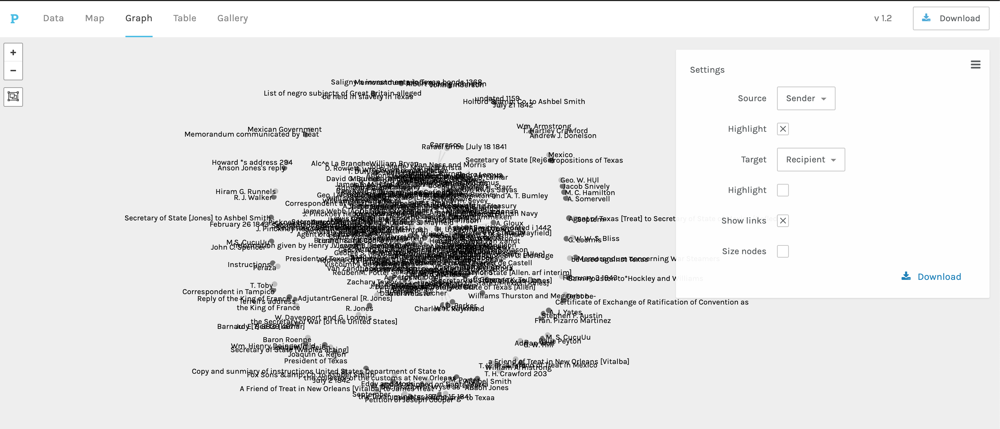
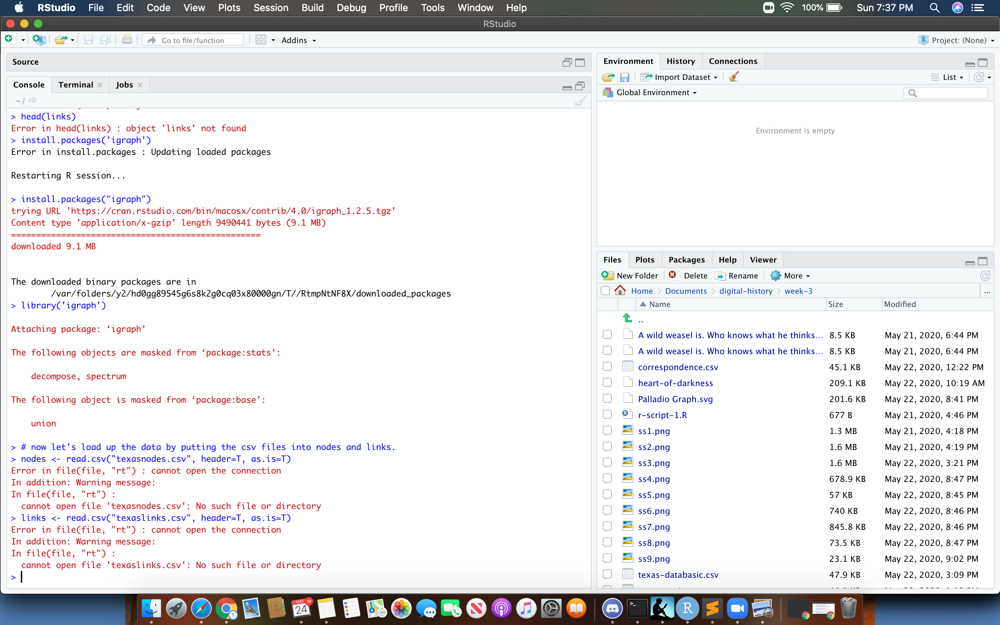

# Week 3 Journal

### Regex in sublime text
- Mostly this was pretty straight-forward, and quite fun to mess around with, although some commands certainly confused me more than others and it would definitely take more consistent practice for me to really have an intuitive understanding of these commands. I found the fact that there was no preview especially frustrating, and greatly appreciate that the row you changed will stay highlighted after a replace all. Some questions/concerns I had during this section: 
- Why the “\n”? I tried replacing all with just a blank space in a different sublime text file (I was trying to clean up a pdf of Conrad’s *Heart of Darkness*), and it worked fine without the “\n” 
- I noticed even when just casually scrolling through the selected lines with “to” in them, that some of the years were on the next line from the line with all their corresponding info. Wonder how/if this will be remedied? The year info could probably be reconstructed fairly easily but that does feel somehow somewhat dishonest. 

### Open refine 
- for some reason, unlike all of the other applications I’ve dowloaded for this course, this one refused to open as a security breach. Usually, the apps have an “open anyway” override directly in the pop-up window, but this time I had to go to system preferences. 
    - [this](https://github.com/OpenRefine/OpenRefine/issues/2191) page explains that it’s because the program/developers “do not have a paid Apple Developer Program account.” And the addition of a malware notice is for the same reason (aka, there is no real increase in chance of malware). This was interesting to me as it’s a little peak into how the corporate structure impacts ease of access to open source material! 
    - I’m also curious as to why the app went from “google refine” to “open refine.” An exciting and heroic break from google’s oligarchic power by an enterprising group of developers? 
- My open refine table did not split into columns automatically, as the instructions seemed to imply they would (?), but I was able to hover over “column 1” and “split into several columns” by guesswork. Then I renamed the columns so it wouldn’t get confusing, and deleted the extraneous “sender, recipient, date” text, so that the row would get deleted in the trimming phase.
- there was no option to export as .csv, so I exported the table as an excel file (.numbers). 
    - Update: Kieran on Discord explained to me how to export from open refine as a .csv file by clicking “comma-seperated value,” so I was able to make a second file where i removed the tildes (which I forgot to do the first time) and also the dates, since I had come to realize the “Networks” section required only 2 columns. 
- Overall, this tool was somewhat clunky but effective. The "cluster" and "merge" tools were certainly very helpful, especially considering hte painstaking alternative. As I understand it, I could also use it to link up all of the correspondences to the text of the actual letters which were on the original document that I cleaned up in Sublime. This might be a neat thing to try out, if I had the time. 

### Networks
- Beginning in Databasic:
    - I tried to upload the .csv file and received an “internal server error.”
    - I tried using the copy and paste function and received the same error.
    - I tried to use one of Databasic’s “sample graphs” and… also got the same error. 
- Palladio:
    - Switching to Palladio as Dr. Graham reccomended, I was able to generate a graph. You can see how it reflects the most corresponded-with people by placing them in the center of the network, and on the outskirts some lone wolves as well as a few errors, including sentences that are clearly not correspondences but just happened to contain the word “to.” 

The general map: 

James' Hamilton and Mayfield at the center: 

Some intriguing edges:

### Bonus Assignment
Becuase I had some extra time, I took a crack at the bonus assignment, but gave up after getting this error:
 
